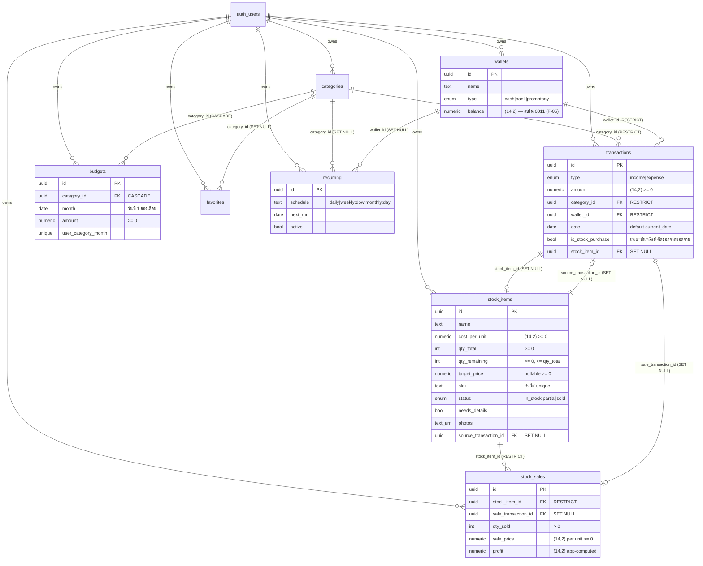

# Stash — Project Audit

> เอกสาร context ถาวรของโปรเจกต์ (read-only audit) — อ่านจากโค้ดจริง ณ branch `claude/expense-stock-audit-yz38u8`, commit `8816c07`
> ผู้ใช้: คนเดียว · Timezone: Asia/Bangkok · สกุลเงิน: THB
> ขอบเขต: อ่านทั้ง `src/`, `supabase/migrations/`, config ทั้งหมด — **ไม่ได้รัน** แอป/DB/tests

---

## 1. Executive Summary

- **สถาปัตยกรรมสะอาดและแยก layer ดี** สำหรับแอปขนาดนี้: DB (RLS + RPC) → `lib/` (helpers) → `hooks/` (data/TanStack Query) → `pages/components` (UI) ชั้นแทบไม่ปนกัน business logic การเงินสรุปเป็น pure function ที่แยกออกจาก component (`computeHomeSummary`, `computeStockHero`, `computePace`)
- **โมเดลบัญชีถูกต้องและ consistent**: การซื้อเข้าสต็อกลงเป็น "รายจ่าย = สินทรัพย์" (`is_stock_purchase=true`) และถูก **กรองออกจากทุกตัวเลขสรุป/งบ** อย่างครบถ้วน (`useHome`, `useBudgets`) เงินเก็บเป็น `numeric(14,2)` ไม่ใช่ float — ถูกต้อง
- **การเขียนที่กระทบสองระบบทำเป็น atomic RPC**: intake (สร้าง expense + stock item) และ delete (ลบ item + expense ต้นทาง) อยู่ใน transaction เดียว ผ่าน `security invoker` (RLS ยังบังคับ) — ดีมาก
- **Security แน่นเกินคาดสำหรับ personal app**: RLS `auth.uid() = user_id` ทุกตาราง, storage แยกตาม uid, RPC มี auth guard, security headers/CSP ครบใน Worker, constraint กันค่าลบใน DB (0009)
- **✅ "การขายสินค้า" ทำแล้วใน 0012 (Model A)** — เดิมไม่มีเลย ตอนนี้มี `stock_sale_create`/`stock_sale_reverse`/`stock_sales_summary` (atomic RPC): ขายลง income เต็มราคา + COGS แยก, ตัด `qty_remaining`, เปลี่ยน `status` → partial/sold, snapshot ต้นทุน, ย้อนการขายได้ + trigger กันแก้/ลบรายการขายตรง (ปิด F-01)
- **🟠 การสร้าง SKU มี race + ไม่ unique + ซ้ำได้หลังลบ** — ใช้ `count(*)+1` ต่อ user โดยไม่มี unique constraint (F-02)
- **🟠 Timezone ไม่ตรงกันระหว่าง client กับ server** — รายการที่ผู้ใช้กรอกใช้วันที่ local (Bangkok) แต่รายการที่สร้างจาก RPC ใช้ `current_date` ของ DB (ปกติ UTC) (F-03)
- **PWA/offline ยังเป็นแค่โครง**: โมดูล `offlineQueue.ts` เขียนไว้ครบแต่ **ไม่ถูก import ที่ไหนเลย** — คำโฆษณา "offline-first write-queue" ยังไม่จริง (F-06)
- **ไม่มี test / ไม่มี ESLint / ไม่มี CI**: script `lint` แท้จริงคือ `tsc --noEmit` เท่านั้น, ไม่มี `.github/workflows/`, ไม่มี test runner ติดตั้ง (F-07)
- **ลบเป็น hard delete ทั้งหมด ไม่มี soft delete / audit trail** — การลบรายการหรือสินค้าย้อนกลับไม่ได้และกระทบรายงานย้อนหลังทันที (F-08)

### 3 เรื่องที่ควรแก้ก่อนพัฒนาต่อ
1. ~~**ทำ "flow การขาย" เป็น atomic RPC**~~ — ✅ **เสร็จใน 0012** (`stock_sale_create`/`reverse`/`summary`, Model A gross, ตัด `qty_remaining` + `status` + snapshot ต้นทุน + guard triggers)
2. **เพิ่ม `unique(user_id, sku)` และเปลี่ยนวิธี gen SKU ให้ไม่พึ่ง `count(*)`** (ใช้ sequence/serial ต่อ user หรือ column counter) เพื่อกันซ้ำจาก race และจากการลบ (F-02)
3. **รวม timezone ให้เป็นระบบเดียว** (บังคับ `date` = วันที่ Asia/Bangkok ทั้ง client และ RPC) ก่อนที่ข้อมูลผิดวันจะสะสม (F-03)

---

## 2. Tech Stack & Dependencies

เวอร์ชันจาก `package.json` (lockfile `package-lock.json` มีอยู่, ระบุ `^` ranges — เวอร์ชัน exact ต้องดู lockfile ราย package; ด้านล่างคือ range ที่ประกาศ)

| ชั้น | เทคโนโลยี | เวอร์ชัน |
|---|---|---|
| Build/bundler | Vite | `^6.0.7` |
| UI | React / React DOM | `^18.3.1` |
| ภาษา | TypeScript | `^5.7.2` (strict, `noUnusedLocals/Parameters`) |
| Routing | react-router-dom | `^6.28.1` |
| Data/cache | @tanstack/react-query | `^5.62.11` |
| Backend SDK | @supabase/supabase-js | `^2.47.10` |
| Icons | @tabler/icons-react | `^3.28.1` |
| Offline store | idb (IndexedDB) | `^8.0.0` (ยังไม่ถูกใช้ — ดู F-06) |
| PWA | vite-plugin-pwa | `^0.21.1` |
| CSS | tailwindcss | `^3.4.17` + postcss/autoprefixer |
| Deploy/runtime | wrangler (Cloudflare Workers) | `^4.112.0` |

- **Backend จริง**: Supabase (Postgres + Auth email/password + Storage) — ไม่มี Prisma, migration เป็น raw SQL รันมือใน SQL Editor
- **ไม่มี**: test framework, ESLint, prettier, form/validation lib (zod ฯลฯ), state manager อื่นนอกจาก React Query + React context
- **จุดสังเกต**: มี comment `eslint-disable` ในโค้ด (`useAuth.tsx:63`) แต่ไม่มี ESLint ติดตั้งจริง

---

## 3. โครงสร้างโปรเจกต์

```
stash-web/
├─ index.html                 SPA entry (Google Fonts, ไม่มี inline script → CSP script-src 'self')
├─ vite.config.ts             Vite + PWA manifest (th, theme mint) + workbox precache (ไม่ cache Supabase)
├─ wrangler.jsonc             Cloudflare Worker: assets=./dist, run_worker_first=true (ให้ security header ครอบทุก response)
├─ tsconfig.*.json            app / node / worker แยกกัน (worker exclude จาก tsconfig.app)
├─ .env.example               VITE_SUPABASE_URL / _ANON_KEY (build var), ANTHROPIC_API_KEY (runtime secret)
│
├─ src/
│  ├─ main.tsx / App.tsx      bootstrap: QueryClient → AuthProvider → ToastProvider → RouterProvider
│  ├─ router.tsx              10 จอ; tabbed อยู่ใต้ <AppLayout>, full-screen flows (add/intake/queue) แยก
│  │
│  ├─ lib/                    ชั้น utility ไร้ side-effect ทาง UI
│  │  ├─ supabase.ts          singleton client (อ่าน env, throw ถ้าไม่ครบ)
│  │  ├─ database.types.ts    types เขียนมือ mirror schema (⚠️ ต้อง sync เอง)
│  │  ├─ dates.ts             monthBounds()/toISODate() — ใช้ local time
│  │  ├─ format.ts            เงินบาท (th-TH), เดือน พ.ศ.
│  │  ├─ sku.ts               previewSku() (mirror RPC, แสดงผลอย่างเดียว)
│  │  ├─ storage.ts           อัปโหลด/sign รูปสต็อก (validate type/size ฝั่ง client)
│  │  ├─ errors.ts            แปลง error → ข้อความไทย (map ตาม SQLSTATE)
│  │  ├─ offlineQueue.ts      IndexedDB outbox — ⚠️ dead code, ไม่ถูก import (F-06)
│  │  ├─ prefs.ts             AI prefs ใน localStorage (ยังไม่ wire)
│  │  └─ icons.tsx / sku.ts
│  │
│  ├─ hooks/                  ทุกการอ่าน/เขียน DB ผ่าน TanStack Query อยู่ที่นี่
│  │  ├─ useAuth.tsx          Auth context (session, signIn/signUp/signOut)
│  │  ├─ useHome.ts           useMonthTransactions + computeHomeSummary (pure)
│  │  ├─ useHistory.ts        useInfiniteQuery (paged 50), groupByDay
│  │  ├─ useAddTransaction / useTransactions   insert/update/delete รายการ
│  │  ├─ useStock / useStockIntake / useQueue  อ่าน/สร้าง/แก้/ลบ stock item
│  │  ├─ useBudgets / useRecurring / useLookups / useSettings
│  │  └─ (⚠️ ไม่มี useStockSale / useSell)
│  │
│  ├─ components/             UI ล้วน (bottom sheet, hero, managers, charts, toast)
│  ├─ pages/                  10 จอ
│  └─ worker/
│     ├─ index.ts             fetch handler: /api/* → route, อื่น → ASSETS; ครอบ security headers
│     ├─ security.ts          CSP + HSTS + X-Frame-Options ฯลฯ (single source)
│     ├─ ai.ts                /api/ai — stub, คืน 501/503 (ยังไม่ทำ)
│     └─ json.ts
│
└─ supabase/migrations/       0001 schema+RLS · 0002 seed · 0003 storage · 0004 intake RPC ·
                              0005 budgets · 0006 stock delete RPC · 0007 recurring RPC ·
                              0008 security hardening · 0009 value constraints  (additive-only)
```

**Data flow (อ่าน)**: Component → hook (`useQuery`) → `supabase.from(...).select()` (RLS กรองตาม uid) → pure compute (`computeHomeSummary`) → render
**Data flow (เขียน)**: Component → hook (`useMutation`) → `supabase.insert/update/rpc` → `onSuccess: invalidateQueries(['transactions'|'stock_items'|...])` → refetch อัตโนมัติ

**การแยก layer**: ดี — ไม่พบ business logic การเงินฝังใน component (ยกเว้นการจัดรูปแบบเล็กน้อย) การ aggregate ทั้งหมดเป็น pure function ที่ test ได้ **จุดที่ logic กระจาย**: กติกา "needs_details" อยู่สองที่ (`computeNeedsDetails` ใน `StockFields.tsx:120` ใช้ตอน intake, แต่ `useQueue.missingTags` + logic ใน `useUpdateStockItem` คำนวณซ้ำอีกชุด) — ควรรวมเป็นแหล่งเดียว

---

## 4. Data Model

ทุกตารางมี `id uuid pk`, `user_id` (default `auth.uid()`, FK → `auth.users` ON DELETE CASCADE), `created_at/updated_at` (trigger `set_updated_at`), และ RLS 4 policy (select/insert/update/delete) แบบ `auth.uid() = user_id` ให้ `authenticated` เท่านั้น



**Index ที่มี**: `transactions(user_id, date desc)`, `transactions(category_id)`, `transactions(stock_item_id)`, `stock_items(user_id, status)`, partial index `stock_items(user_id) where needs_details`, `stock_sales(stock_item_id)`, `stock_sales(user_id)`, `budgets(user_id, month)`, + `*_user_idx` ทุกตาราง

**ประเด็น data model**
- **`stock_items.sku` ไม่มี unique constraint** (0001:102) — เปิดช่องให้ SKU ซ้ำ (F-02)
- **`wallets.balance numeric(14,2)`** เป็น dead field — **ไม่มีโค้ดใดอ่านหรือเขียน** (ยืนยันทั้ง read + write path); รายการผูก `wallet_id` เป็นแค่ป้ายกำกับ → **ลบทิ้งใน 0011 (F-05, PR #30)**
- **ไม่มี index บน `transactions(wallet_id)`** ทั้งที่ FK เป็น RESTRICT (ตอนลบ wallet ต้อง scan) — โหลดน้อยสำหรับ user เดียวจึงไม่วิกฤต
- **`stock_sales`** ถูกเขียนโดย `stock_sale_create` (0012) แล้ว — มี `cost_at_sale`/`cogs_transaction_id`/`sold_on` เพิ่ม; ทุกแถวผูก income + COGS transaction
- FK policy ออกแบบมาดี: ledger (category/wallet) เป็น RESTRICT กันข้อมูลสรุปพัง, การผูก stock↔transaction เป็น SET NULL กันเงินหาย, budget เป็น CASCADE (config)

---

## 5. Domain Rules ที่โค้ดใช้อยู่จริง *(ส่วนสำคัญที่สุดสำหรับ context ต่อ)*

### กฎการเงิน
1. **เงินเป็น `numeric(14,2)` ใน DB** (สตางค์ผ่าน 2 ตำแหน่งทศนิยม) — ไม่ใช่ float ฝั่ง DB; แต่ฝั่ง JS อ่านเป็น `number` (float) แล้วคำนวณ/แสดงผล (`useStock.ts:90-92`) การคูณ/ลบเพื่อโชว์กำไรทำใน JS
2. **keypad จำกัดทศนิยม 2 ตำแหน่ง และตัวเลขรวม ≤ 9 หลัก** (`AddPage.tsx` `press()`), ไม่มี leading zero
3. **การซื้อเข้าสต็อก = รายจ่ายประเภทสินทรัพย์**: `is_stock_purchase=true`, `amount = cost_per_unit * qty` (คำนวณเป็น numeric ใน RPC `0004:54`)
4. **ทุกยอดสรุป/งบ ตัด `is_stock_purchase=true` ออก**: `computeHomeSummary` (safe-to-spend, donut, trend), `useMonthSpending`, `useBudgets`, history filter `expense` — **consistent ทุกที่** กำไรรับรู้ทีหลังตอนขาย (แต่ยังไม่มี flow ขาย)
5. **safe-to-spend = income − expense (เดือนนั้น)** ไม่ใช่ยอดกระเป๋าจริง (`useHome.ts` `computeHomeSummary`) — "balance" บน WalletHero คือค่านี้
6. **deltaPct เทียบเดือนก่อน** คืน `null` เมื่อ `prevSafe <= 0` (เดือนก่อนไม่มีข้อมูลหรือติดลบ)
7. **budget pace**: `over` เมื่อ used > budget; `fast` เมื่อ ratio > (สัดส่วนวันที่ผ่านไป × 1.1); ที่เหลือ `on_track` (`computePace`)
8. **ไม่มี VAT / ภาษี / ส่วนลด / ค่าธรรมเนียม** ในระบบเลย — เป็น personal tracker ตรงๆ
9. **ไม่มีการรักษายอดคงเหลือต่อกระเป๋า** (ดูข้อ data model)
10. **backdate ได้ถึงวันนี้** (`max={today}`) แต่ห้ามอนาคต

### กฎสต็อก
11. **intake เป็น atomic**: 1 ครั้งสร้าง (a) expense `is_stock_purchase=true` (b) stock_item `qty_total=qty_remaining=qty, status='in_stock'` (c) ผูก 2 ทาง ผ่าน RPC `stock_intake_create` (`security invoker`, RLS บังคับ)
12. **SKU = `STZ-<BRAND3>-<seq4>`**: BRAND3 = 3 ตัวอักษร/เลขแรกของแบรนด์ (uppercase) หรือ `GEN`; seq = `count(*)+1` ต่อ user (`0004:62`) — ⚠️ ไม่ unique, ซ้ำได้ (F-02)
13. **needs_details = true** เมื่อขาด อย่างใดอย่างหนึ่งใน {รูป, ไซซ์, สี, สภาพ, ราคาขาย} (`computeNeedsDetails`) — item เข้า "คิวรอเติมรายละเอียด" (`/stock/queue`); เติมครบแล้ว flag เป็น false อัตโนมัติตอน update (`useQueue.useUpdateStockItem`)
14. **ลบ stock item เป็น atomic**: RPC `stock_item_delete` ลบ item + expense ต้นทาง (`is_stock_purchase=true`) ในคำสั่งเดียว **แต่บล็อกถ้ามี `stock_sales`** (กันประวัติกำไรหาย) — ทั้ง guard ในฟังก์ชันและ FK RESTRICT (defence in depth)
15. **hero สต็อก**: `costValue = Σ cost_per_unit × qty_remaining` (เฉพาะ status ≠ sold); `pendingProfit = Σ (target_price − cost_per_unit) × qty_remaining` (`computeStockHero`)
16. **ขายเป็น atomic (Model A gross, `stock_sale_create` 0012)**: 1 การขาย = (a) income = `sale_price×qty` หมวด `system_key='stock_sale_income'` (b) expense COGS = `cost_per_unit×qty` หมวด `system_key='stock_cogs'`, `is_stock_cogs=true`, wallet null (c) ตัด `qty_remaining`, set `status` (0=sold, <total=partial) (d) เขียน `stock_sales` พร้อม snapshot `cost_at_sale`+`sold_on`+`profit=(price−cost)×qty`. คำนวณเงินใน SQL ทั้งหมด, lock item ด้วย `for update`, วันที่ Asia/Bangkok (ห้ามอนาคต)
17. **โมเดลบัญชี Model A**: `safe-to-spend = income − expense` **คงสูตรเดิม** — COGS (is_stock_purchase=false) นับใน expense/donut/เงินออก ตามปกติ, netไปกับ income ขายเหลือ = กำไรพอดี; **ตัด COGS ออกจาก budget เท่านั้น** (`isBudgetSpendingRow`). ขายขาดทุนได้ (ledger บวกทั้งคู่, `stock_sales.profit` ติดลบ)
18. **ย้อนการขาย (`stock_sale_reverse`)**: ลบ `stock_sales` **ก่อน** แล้วลบ income+COGS txn (ผ่าน guard SECTION 8 เพราะ reference หายก่อน), คืน `qty_remaining` + status; lock sale row ด้วย `for update` กันคืนซ้ำ
19. **snapshot ต้นทุน**: หลังมีการขาย trigger กัน `cost_per_unit`/`qty_total` เปลี่ยน (SECTION 6); การตีมูลค่าการขายเดิมใช้ `cost_at_sale` ไม่กระทบจากการแก้ทีหลัง
20. **หมวด system**: `ขายสต็อก`(income) + `ต้นทุนขายสต็อก`(expense) เป็น `is_system=true` (ลบไม่ได้ — trigger SECTION 7), resolve ด้วย `system_key` ตอน runtime (ห้าม match ชื่อไทย); ซ่อนจาก AddPage เฉพาะ `stock_cogs` (ขายสต็อกยังบันทึกมือได้)

### กฎ recurring
21. **schedule เข้ารหัสเป็น string**: `daily` / `weekly:<dow>` (advance +7 วันเสมอ, dow เป็นแค่ label) / `monthly:<day>` (clamp วันตามความยาวเดือน, เก็บวันเดิมไว้เพื่อคืนค่า เช่น 31 ม.ค.→28 ก.พ.→31 มี.ค.)
22. **materialize ตอนโหลดแอป**: `recurring_run_due()` ถูกเรียกครั้งเดียวต่อ load (`useRunRecurringOnLoad`), backfill ทุก occurrence ที่ค้าง (cap 500/call), advance `next_run`, ใช้ `for update skip locked` กันยิงซ้ำจากหลาย tab; schedule ที่ parse ไม่ได้ → set `active=false`
23. **error จาก `recurring_run_due` ถูกกลืนเงียบ** (เผื่อยังไม่รัน migration 0007) — `useRecurring.ts:104`

### กฎ auth/ownership
24. **RLS ทุกตาราง**: `auth.uid() = user_id` — anon เข้าไม่ถึง; anon key ปลอดภัยฝั่ง client เพราะ RLS
25. **seed อัตโนมัติตอน signup** ผ่าน trigger `on_auth_user_created` → `seed_defaults_internal` (locked down, เรียกตรงไม่ได้); แจก **3 wallets + 12 categories** = expense 8 (รวม stock 2 + `ต้นทุนขายสต็อก` system) + income 3 (รวม `ขายสต็อก` system) + seed `stock_sku_config` (0011/0012) — user ใหม่ขาย/รับเข้าคลังได้ทันที
26. **storage แยกตาม uid**: path `<user_id>/<...>`, RLS ตรวจ segment แรก = `auth.uid()`, bucket private, จำกัด image type + 10MB (0009)

---

## 6. Feature Inventory

| ฟีเจอร์ | สถานะ | ไฟล์หลัก |
|---|---|---|
| Auth (email/password sign-in) | ✅ เสร็จ | `useAuth.tsx`, `LoginPage.tsx`, `RequireAuth.tsx` |
| Sign-up UI | ⚠️ ไม่มี UI (มี `signUpWithPassword` แต่ไม่ถูกเรียก — single user) | `useAuth.tsx:48` |
| หน้าหลัก (สรุปเดือน + trend + donut) | ✅ เสร็จ | `HomePage.tsx`, `useHome.ts`, `WalletHero.tsx`, `charts.tsx` |
| เพิ่มรายการ (keypad + หมวด + กระเป๋า + favorite) | ✅ เสร็จ | `AddPage.tsx`, `useAddTransaction.ts` |
| ประวัติ (paged + filter + ค้นหา + group รายวัน) | ✅ เสร็จ (ค้นหาเฉพาะ note) | `HistoryPage.tsx`, `useHistory.ts` |
| แก้ไข/ลบรายการ | ✅ เสร็จ (stock row = read-only บางฟิลด์) | `TransactionEditSheet.tsx`, `useTransactions.ts` |
| รับเข้าสต็อก (intake + โหมดรวบรวม + รูป + SKU preview) | ✅ เสร็จ | `StockIntakePage.tsx`, `useStockIntake.ts`, `0004` |
| คลังสินค้า (list + filter + ค้นหา + hero) | ✅ เสร็จ | `StockPage.tsx`, `useStock.ts` |
| แก้ไข/ลบสินค้า | ✅ เสร็จ | `StockEditSheet.tsx`, `0006` |
| คิวเติมรายละเอียด | ✅ เสร็จ | `StockQueuePage.tsx`, `useQueue.ts` |
| **ขายสินค้า / ตัดสต็อก / รับรู้กำไร** | ✅ เสร็จ (0012, Model A) | `stock_sale_create` `0012`, `useStockSale.ts`, `StockEditSheet.tsx` |
| ย้อนการขาย (reverse) | ✅ เสร็จ (0012) | `stock_sale_reverse`, `useStockSale.ts`, `StockEditSheet.tsx` |
| stat ยอดขาย/กำไรเดือนนี้ | ✅ เสร็จ (0012) | `stock_sales_summary`, `useStockSales.ts`, `StockPage.tsx` |
| แท็บ "ขายแล้ว" | ✅ ทำงาน (status → partial/sold ตอนขาย) | `StockPage.tsx`, `stock_sale_create` |
| งบประมาณต่อหมวด/เดือน | ✅ เสร็จ | `BudgetPage.tsx`, `useBudgets.ts`, `0005` |
| รายการโปรด (favorites) | ✅ เสร็จ | `FavoritesManager.tsx`, `useLookups.ts` |
| รายการประจำ (recurring) | ✅ เสร็จ | `RecurringManager.tsx`, `useRecurring.ts`, `0007` |
| ตั้งค่า (หมวด/กระเป๋า) | ✅ เสร็จ | `SettingsPage.tsx`, `useSettings.ts` |
| ยอดคงเหลือต่อกระเป๋า | 🔴 ไม่มี (field `balance` ลบทิ้งแล้วใน 0011) | `wallets` |
| PWA (installable, precache app shell) | ✅ เสร็จ | `vite.config.ts` |
| Offline write-queue (sync เมื่อกลับ online) | 🔴 dead code (ไม่ถูก import) | `offlineQueue.ts` |
| AI (พิมพ์/พูด, สแกน, auto-category) | 🔴 stub (UI disabled, `/api/ai` คืน 501) | `worker/ai.ts`, `prefs.ts`, `AddPage.tsx` |
| Security headers / CSP | ✅ เสร็จ | `worker/security.ts` |

---

## 7. Findings

| ID | Severity | หมวด | ปัญหา | ไฟล์:บรรทัด | ผลกระทบ | แนวทางแก้ |
|---|---|---|---|---|---|---|
| F-01 | ✅ Resolved | D/E ฟีเจอร์ | **ไม่มี flow การขาย/ตัดสต็อกเลย** (เดิม) | `stock_sale_*` `0012`, `useStockSale.ts`, `StockEditSheet.tsx` | — | **แก้แล้วใน 0012 (PR)** — `stock_sale_create`/`reverse`/`summary` atomic (Model A): income+COGS, ตัด qty + status, snapshot ต้นทุน, ย้อนได้ + trigger กันแก้/ลบรายการขายตรง |
| F-02 | 🟠 High | B/D | **SKU ไม่ unique + race + ซ้ำหลังลบ**: `select count(*)+1` ต่อ user, ไม่มี unique constraint | `0004_stock_intake_rpc.sql:62`, `0001_init.sql:102` | intake พร้อมกัน 2 รอบ / ลบแล้วเพิ่มใหม่ → SKU ชนกัน อ้างอิงสินค้าผิดตัว | เพิ่ม `unique(user_id, sku)`; เปลี่ยน gen เป็น per-user counter column หรือ sequence (ไม่พึ่ง `count`) แล้ว retry ถ้าชน |
| F-03 | 🟠 Medium | C | **Timezone ไม่ตรง**: client กรอกใช้ local date (Bangkok), RPC ใช้ `current_date` ของ DB (Supabase = UTC) | `dates.ts:toISODate`, `0004:69` (intake), `0007` (recurring เทียบ `current_date`) | ซื้อเข้าสต็อก/รายการ recurring ช่วง 00:00–07:00 น. อาจลงวันก่อนหน้า → ยอดรายวัน/รายเดือนคลาด | บังคับวันที่เป็น Asia/Bangkok ทั้งสองฝั่ง: ส่ง `date` จาก client เข้า RPC แทน `current_date`, หรือ set `timezone='Asia/Bangkok'` + ใช้ `(now() at time zone 'Asia/Bangkok')::date` ใน RPC |
| F-04 | 🟠 Medium | G | **Photo upload ล้มเหลวเงียบ**: `catch {}` ว่างใน `onAddPhotos` ของ edit sheet, ไม่มี error state แสดง | `StockEditSheet.tsx:63-66` | อัปโหลดรูปพลาด (เน็ต/quota) ผู้ใช้ไม่รู้, คิดว่ารูปเข้าแล้ว | เพิ่ม error state + toast เหมือน `StockIntakePage.onAddPhotos` (ที่ใช้ `toast.error` ถูกต้องแล้ว) |
| F-05 | ✅ Resolved | B/D | **`wallets.balance` เป็น dead field** — ไม่เคยอ่าน/เขียน (ยืนยัน read+write path แล้ว) | `database.types.ts`, `0001` wallets | — | **แก้แล้วใน 0011 (PR #30):** `drop column wallets.balance` + เอาออกจาก `seed_defaults_internal` + `database.types.ts` (ตัดสินใจข้อ (ก) ลบทิ้ง) — รอ apply |
| F-06 | 🟠 Medium | A/I | **Offline queue เป็น dead code** — `offlineQueue.ts` (enqueue/pending/…) ไม่ถูก import ที่ใด แต่ README/vite comment โฆษณา "offline-first write-queue" | `offlineQueue.ts` ทั้งไฟล์, `useQueue.ts` (คนละเรื่อง) | เขียน offline ไม่ถูก queue จริง — mutation ตอนไม่มีเน็ตจะ fail; ความคาดหวังไม่ตรงกับความจริง | wire เข้ากับ mutation hooks (part 5 ที่ยังไม่ทำ) หรือปรับ README ให้ตรงสถานะ |
| F-07 | 🟠 Medium | J | **ไม่มี test / ESLint / CI**: `lint` = `tsc --noEmit`, ไม่มี test runner, ไม่มี `.github/workflows/` | `package.json:scripts`, `.github/` | ไม่มี regression net; pure functions (`computeHomeSummary/Pace/StockHero`) test ง่ายแต่ไม่ถูก test; refactor เสี่ยง | เพิ่ม Vitest + test pure functions การเงิน/สต็อกก่อน, ESLint จริง, GitHub Action รัน typecheck+test |
| F-08 | 🟡 Low | E | **Hard delete ทั้งหมด ไม่มี soft delete/audit** — ลบรายการ/สินค้าหายถาวร, ไม่มี log | `useTransactions.ts` delete, `0006` | ลบผิดกู้ไม่ได้; ไม่มีร่องรอยตรวจสอบย้อนหลัง | พิจารณา `deleted_at` + กรองทุก query, หรือ export/backup ก่อนลบ (single-user จึงไม่วิกฤต) |
| F-09 | 🟡 Low | F | **การกันแก้/ลบ stock-purchase เป็น UI-only** — server (RLS) ยอมให้เจ้าของลบ expense ต้นทางตรงๆ ได้ ทำให้ stock item กำพร้า (`source_transaction_id` → null) | `useTransactions.ts:useDeleteTransaction`, guard อยู่แค่ `TransactionEditSheet.tsx` | เรียก API ตรง/ผ่าน client ที่ถูกแก้ ลบ expense ได้ → เงินหาย stock ค้าง (single-user เสี่ยงต่ำ) | ย้าย guard ลง DB: trigger บล็อกลบ transaction ที่ `is_stock_purchase=true` หรือให้ผ่าน RPC เท่านั้น |
| F-10 | 🟡 Low | C/I | **คำนวณเงินฝั่ง client เป็น JS float** (`Number(...)` แล้วคูณลบ) | `useStock.ts:90-92`, `StockIntakePage.tsx` profit | อาจมี floating error เล็กน้อยตอนแสดงผล (0.1+0.2); ยังไม่กระทบข้อมูลที่บันทึก (DB numeric) | คำนวณยอดที่บันทึกจริงใน SQL/numeric เสมอ (intake ทำถูกแล้ว); ระวังตอนทำ flow ขาย |
| F-11 | 🟡 Low | H/UX | **ค้นหาประวัติจับเฉพาะ `note`** (`ilike '%q%'`) ไม่รวมชื่อหมวด/จำนวน | `useHistory.ts` | ค้นหาไม่เจอตามที่ผู้ใช้คาด | ขยาย search ให้รวม category name (ผ่าน join filter) ถ้าจำเป็น |
| F-12 | 🟡 Low | I | **`database.types.ts` sync มือ** — Functions ไม่มี `seed_defaults`; `Insert<T>=Partial<T>` ทำให้ required field ไม่ถูก type-check ตอน insert | `database.types.ts` | type อาจ drift จาก schema; insert ที่ลืม field ไม่ถูกจับ | ใช้ `supabase gen types typescript` แทนการเขียนมือ |
| F-13 | 🟡 Low | F | **CSP ใช้ wildcard `*.supabase.co`** + `style-src 'unsafe-inline'` | `worker/security.ts` | หลวมกว่าที่ควร (ยอมรับได้/มี comment เตือนแล้ว) | pin เป็น `<ref>.supabase.co` ตอน deploy จริง |
| F-14 | 🟡 Low | G | **`recurring_run_due` error กลืนเงียบถาวร** — ตั้งใจเผื่อ migration ยังไม่รัน แต่ปิดบัง error จริงตลอดไป | `useRecurring.ts:104` | ถ้า RPC พังหลัง 0007 ผู้ใช้ไม่รู้ว่ารายการประจำไม่เดิน | log/แยกกรณี "function not found" ออกจาก error อื่น |
| F-15 | 🟠 Medium | J | **Migration hand-run ไม่มี ledger + ไฟล์ที่ apply แล้วเคยถูกแก้ + ฟังก์ชันถูก redefine ข้ามไฟล์** — 0002 ถูกแก้หลัง commit แรก (search_path), seeder ถูก `create or replace` ซ้ำใน 0008, รันมือใน SQL Editor ไม่มีบันทึกว่า apply ไฟล์ไหน/เมื่อไหร่ | `0002`/`0008` seed, git log | พิสูจน์ไม่ได้ว่า DB ตรงกับไฟล์เวอร์ชันใด → กระทบทุกครั้งที่ reproduce function จากไฟล์ (เช่น 0011) | **เริ่มแก้ใน 0011 (PR #30):** ตาราง `schema_migrations` self-record ทุก migration; + ห้ามแก้ไฟล์ที่ apply แล้ว (เขียนใหม่แทน); พิจารณา Supabase CLI migrations |
| F-16 | 🟡 Low | G | **หน้า intake ไม่มี empty-state เมื่อ user ลบหมวด stock หมด** — `stockCategories` ว่าง → dropdown "เลือกหมวด" ไม่มีตัวเลือก, บันทึกไม่ได้ โดยไม่มีคำอธิบาย/ปุ่มสร้างหมวด | `StockIntakePage.tsx:46`, `204` | user ที่เผลอลบหมวด stock เข้าคลังไม่ได้และไม่รู้สาเหตุ (recoverable แต่เดาไม่ถูก) | เพิ่ม empty-state + ลิงก์สร้างหมวด stock เมื่อ `stockCategories.length===0` |

---

## 8. Convention & Glossary

### Naming pattern
- **Hooks**: `useXxx` (query) / `useCreateXxx`/`useUpdateXxx`/`useDeleteXxx`/`useUpsertXxx` (mutation)
- **Pure compute**: `computeXxx` (ไม่มี side-effect, รับ data → คืนสรุป) แยกจาก hook เพื่อ test ได้
- **RPC**: snake_case กริยา-นาม `stock_intake_create`, `stock_item_delete`, `recurring_run_due` — พารามิเตอร์ prefix `p_`, ตัวแปรใน function prefix `v_`
- **Query keys**: array ลำดับชั้น `['transactions','summary',userId,monthKey]` — ใช้ partial-match invalidation (`invalidateQueries({queryKey:['transactions']})` เคลียร์ทั้ง subtree)
- **Migration**: `NNNN_snake_name.sql` เลข 4 หลัก, **additive-only** (create/alter เท่านั้น ไม่ drop), idempotent (`if not exists` / `create or replace`), รันมือใน Supabase SQL Editor
- **ตาราง**: มาตรฐานคือ `id uuid pk default gen_random_uuid()` + `user_id` แยก **ยกเว้น** ตาราง config แบบ 1 แถว/user (เช่น `stock_sku_config`, 0011) ที่ตั้งใจใช้ **`user_id` เป็น PK** เพื่อบังคับ singleton ต่อ user — เบี่ยงจาก pattern โดยตั้งใจ ไม่ใช่เขียนผิด
- **เงิน**: `numeric(14,2)` ใน DB; แสดงผลผ่าน `formatBaht` (ไม่มีทศนิยม) / `formatBaht2` (2 ตำแหน่ง); เดือนใช้ พ.ศ. (`formatMonthLong`)
- **UI ภาษาไทยล้วน**, error แปลผ่าน `translateError` (map ตาม SQLSTATE ก่อน แล้วค่อย fragment); Tailwind ใช้ design token (`mint-deep`, `hairline`, `fill`, `expense`, `income`)

### Glossary โดเมน
| คำ | ความหมายในโค้ด |
|---|---|
| `is_stock_purchase` | รายจ่ายที่เป็นการซื้อสินค้าเข้าสต็อก = สินทรัพย์ → **ตัดออกจากยอดจ่าย/งบ** |
| safe-to-spend (คงเหลือ) | `income − expense` ของเดือน (ไม่ใช่ยอดกระเป๋า) |
| stock category | หมวดที่ `is_stock_category=true` → กดบันทึกแล้วเปิดฟอร์มสต็อกอัตโนมัติ |
| needs_details / คิว | สินค้าที่ยังขาดรูป/ไซซ์/สี/สภาพ/ราคาขาย → รอเติมที่ `/stock/queue` |
| intake / รับเข้าสต็อก | ซื้อเข้า 1 ครั้ง = expense + stock_item (atomic RPC) |
| pending profit / กำไรที่รอขาย | `(target_price − cost) × qty_remaining` (ประมาณการ, ยังไม่รับรู้) |
| SKU | `STZ-<BRAND3>-<seq4>` |
| favorite / รายการโปรด | preset กดเพิ่มรายการเร็ว (label + amount + category) |
| recurring | รายการประจำ materialize เป็น transaction ตอนโหลดแอป |

### Pattern ที่ควรทำตามเมื่อเขียนโค้ดใหม่
1. **การเขียนที่กระทบหลายตาราง → ทำเป็น RPC atomic** (`security invoker`, set `search_path=''`, ตรวจ `auth.uid()`) อย่าเขียนหลาย statement ต่อกันฝั่ง client
2. **ทุก mutation → `invalidateQueries` key ที่เกี่ยวข้องใน `onSuccess`**
3. **business logic การเงิน/สต็อก → แยกเป็น pure `computeXxx`** อย่าฝังใน JSX
4. **ยอดที่ **บันทึกจริง** ต้องคำนวณใน SQL/numeric** (ฝั่ง client คำนวณเพื่อแสดงผลได้ แต่ห้ามเป็นแหล่งความจริง)
5. **ตัด `is_stock_purchase=true` ออกจากทุกตัวเลขค่าใช้จ่าย/งบเสมอ** (ทำผิดจุดเดียว = ตัวเลขเพี้ยน)
6. **error → `translateError` + toast**; อย่าใช้ `catch {}` ว่าง (ดู F-04)
7. **migration ใหม่ = ไฟล์ใหม่ additive-only** อย่าแก้ไฟล์ที่ apply แล้วเด็ดขาด (F-15)
8. **RLS: user_id default `auth.uid()` + policy 4 ตัว** ทุกตารางใหม่
9. **ทุก migration ตั้งแต่ 0011 ต้อง self-record** ท้ายไฟล์ด้วย `insert into public.schema_migrations(version) values ('NNNN') on conflict do nothing;` (ledger บอกได้ว่า DB อยู่ที่ไฟล์ไหน — F-15)
10. **เปลี่ยน signature ของ function = `drop function <sig เต็ม>` ก่อน `create`** (ไม่ใช่ `create or replace` เฉย ๆ ไม่งั้นได้ overload ซ้อนเงียบ) แล้ว **re-grant** เพราะ drop ล้าง grant
11. **migration ที่เพิ่ม/ลบ RPC หรือคอลัมน์ → ปิดไฟล์ด้วย `notify pgrst, 'reload schema';`** (กัน PostgREST cache ค้าง → RPC 404 / payload 400)
12. **transaction ที่ผูกกับ `stock_sales` (income หรือ COGS ของการขาย) ห้ามแก้/ลบตรง** — ต้องผ่าน `stock_sale_reverse` เท่านั้น (บังคับด้วย trigger DB SECTION 8 ของ 0012 ไม่ใช่แค่ซ่อนปุ่ม); UI ล็อก amount/หมวด/วันที่ของแถวเหล่านี้ (ดู `isSaleLinkedRow`)
13. **การจัดประเภท transaction ใช้ `lib/ledger.ts` เป็นแหล่งเดียว** (`isIncomeRow`/`isSpendingRow`/`isBudgetSpendingRow`/`isSaleLinkedRow`/`isStockLinkedRow`) — ห้าม inline เงื่อนไข flag ซ้ำใน hook/component
14. **หมวด system** (`is_system`+`system_key`): resolve ด้วย `system_key` ตอน runtime เท่านั้น (ห้ามใช้ชื่อไทยที่ user แก้ได้), ลบไม่ได้ (trigger), backfill ครั้งเดียวใน migration ใช้ชื่อได้

---

## 9. ข้อจำกัดของ audit นี้

- **ไม่ได้รันจริง**: ไม่ได้ execute แอป, ไม่ได้ต่อ Supabase/ดู schema จริงใน DB, ไม่ได้ดู lockfile ราย package เพื่อยืนยันเวอร์ชัน exact — อ่านจาก source + migration files เท่านั้น สถานะจริงของ DB อาจต่างจาก migration ถ้ามีการแก้มือใน dashboard
- **สมมติฐาน timezone ของ DB** (F-03): อ้างว่า Supabase default = UTC ตาม convention — **ไม่แน่ใจ — ต้องตรวจสอบเพิ่ม** ค่า `timezone` จริงของ project/role (`show timezone;`) เพื่อยืนยันผลกระทบ
- **ไฟล์ที่อ่านผ่านๆ ไม่ละเอียดทุกบรรทัด**: `components/charts.tsx`, `WalletHero.tsx` (อ่านเฉพาะ props/logic ไม่ครบทุก animation), `AppLayout.tsx` (ครึ่งไฟล์), `CategoriesManager/WalletsManager/FavoritesManager/RecurringManager.tsx`, `ui.tsx`, `Toast.tsx`, `ConfirmDialog.tsx`, `icons.tsx`, `StockQueuePage.tsx`, `SettingsPage.tsx`, `BudgetPage.tsx`, `HistoryPage.tsx` (อ่าน hook แต่ไม่ทุกบรรทัด JSX) — อาจมี finding เล็กๆ ที่ตกหล่น
- **ไม่ได้ตรวจ**: accessibility (a11y) เชิงลึก, bundle size จริง (ไม่ได้ build), performance ภายใต้ข้อมูลจริงปริมาณมาก, พฤติกรรม PWA/service-worker ตอน update, การ handle session expiry/refresh token edge cases
- **ไม่ได้ประเมิน**: `index.html` (Google Fonts/meta) แบบละเอียด, `tailwind.config.ts` token ทั้งหมด, `public/` assets
- **บริบทผู้ใช้จาก prompt ไม่ครบ** (ช่อง "[เติมเอง]") — สรุป stack จากไฟล์จริงแทน; หากตั้งใจให้เป็น multi-user (ร้าน 2-3 คน) ต้องประเมิน authorization/ownership ใหม่ทั้งหมด เพราะปัจจุบันออกแบบเป็น single-user (แต่ละ user เห็นเฉพาะข้อมูลตัวเอง ไม่มีการ share)
